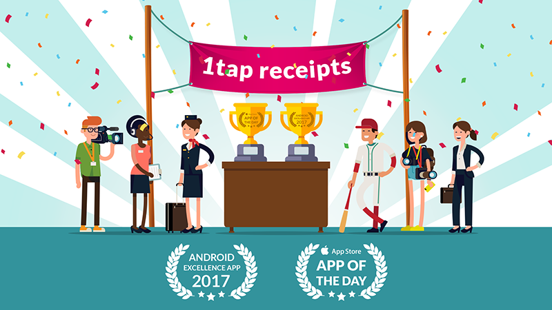

# 
Andrea Sciutto

02102728775 - sciutand@gmail.com - 19-Dec-1971

## Work experience

### [Archipro](https:archipro.co.nz)(2015/present)

#### Senior full stack developer
- Build and Mantain backend services
- Graphql api
- React Frontend
- Elastic search implementation wich custom mappings, aggregates and other adavance ES functionality
- Build pipeplines for seeding and deploying indexes and alias in a CI environment
- SilverStripe php framework
- Docker and AWS stack.

### [1Tap](https://1tapreceipts.com) (ReceiptBank group) 2015/2018

#### Senior iOS and Android developer
- Build framework to expose backend api to client apps using SOLID and KISS principles (iOS and android)
- Build Client app to implement UI and UX as per designs specifications (iOS only)
- Unit, Integration and UI tests to achieve speed of development, parallel build and stability of the framework and client app
- Work with backend team to develop api documentation.
- Machine learning: worked with ML team to improve accuracy of classifiers based on reviewed data
- Swift, Java, Carthage, Cocoapods, Alamofire, CoreData, Jenkins, Buddibuild, Jira, swiftlint RxSwift, RxJava, Retrofit, Gradle, Fabric, Firebase, Docker, Apiblueprint, Mulesoft, Postman, Newman, Github, Gitflow, Realm database
- Nominated Excellend Android app of 2017 and feature as app of the day in the App store

### ReceiptBank 2014/15

#### Senior Android developer and intermediate iOS developer
- Build Android app based on specification.
- Apple watch app
- Objective-c, ORMLite

### Geoop 2011/14

#### Mobile and Api team leader 2013/14
- Implemented a design first developement process
- Implemented policies around pull requests, code commits and issue tracking
- Ensured quality with unit and integration tests and applied TDD
- Build public Api and developer portal
- Manage continuous integration systems
- Php, HTML, Javascript, Bitbucket, Jira, Wordpress, Zend Framework, Phalcon, Angular, Postgresql, Jenkins, AWS

#### Intermediate Android developer and Junior iOS developer 2011/2013
- Build Android app
- Port iOS app for iPhone to iPad

### Merrill Lynch (London) 1998/2006

#### Trader
- Trading Interest rated swaps and derivatives
- Trading Cash and Repo products across European Government debt
- Develop C++ and Visual basic MSExcel plugins 

## Other IT interests

In smaller builds, personal research and pet projects I've also been exposed to the following in no specific order:

- Graqhql, Nodejs, Loopback, Sailsjs, Express, React, React Native, angular 2 and 4, Responsive website, AMP

## Education

### University of Genoa, Italy 1996
- Bachelor degree in Business and Administration Major: “Finance and Banking”. Certified by NZQA as Post Graduate Diploma in Business Level 8

### UK sailing academy 2006
- Ocean Yachmaster Offshore

## Interests and superpowers

- Between 2006 and 2010 sailed onborad Pointzero from Italy to New Zealand
- Scuba and freediving
- Wood working and welding
- Love making oustanding neapolitan pizzas
